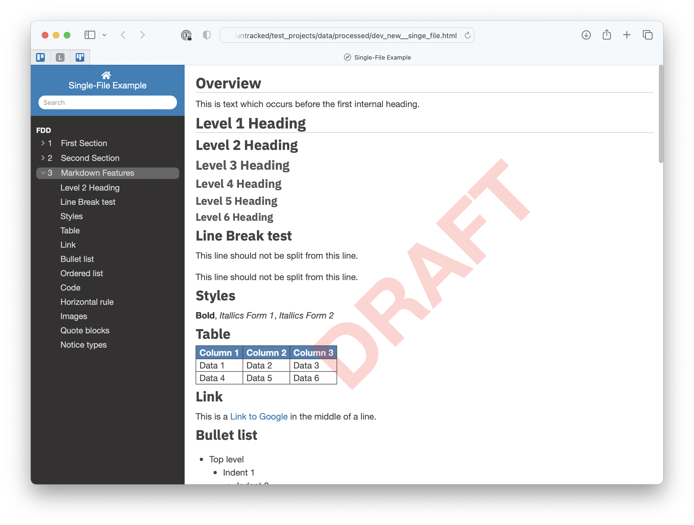

# README

Electro is a light static site _and_ **single-file** html document generator similar in output style to `mkdocs` but with improved menu navigation at the expense of dropping support for older browsers.

There isn't any documentation and there aren't any examples yet, since it's still a work in progress.

I am using it "in production" for a few real projects, so it's working, and functionally stable.

## Contributions
Generally speaking, `electro` is open-to-view but closed-to-contribution.  That's not 100% true, in that I would likely accept bug fixes, but I am aggressively opposed to bloating this project to handle hundreds of niche use cases. 

My primary goal is to serve my own publishing use cases, which succinctly are:
- Be able to publish markdown as a static site.
- Be able to publish markdown as a single (self-contained, stand-alone) html file.
- Provide nice menu navigation.
- Provide document search.
- Provide paragraph numbering.

My secondary goal is to keep `electro` lean.

## The v1.0.2 Milestone
`v1.0.2` is arguably the first "production ready" release; it merges the ability to generate static sites with the ability to generate "single file" documents (i.e. a published document as a single `.html` file with embedded images, etc. suitable for emailing, archiving, etc.)

The project is still missing proper documentation or examples. Example documents will follow next.